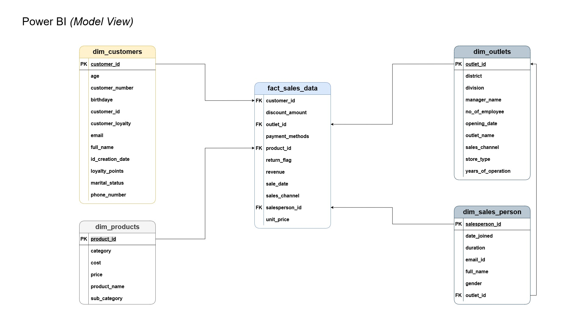
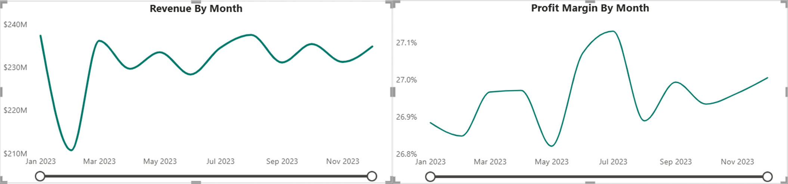
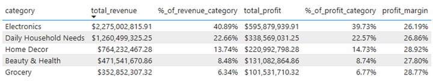
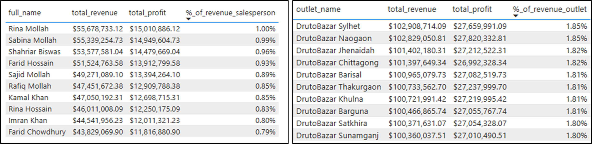
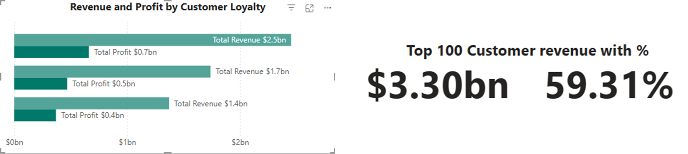
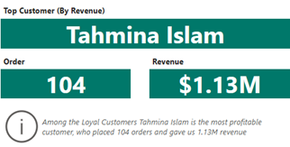
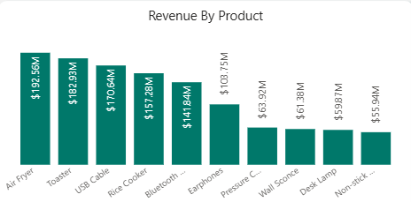
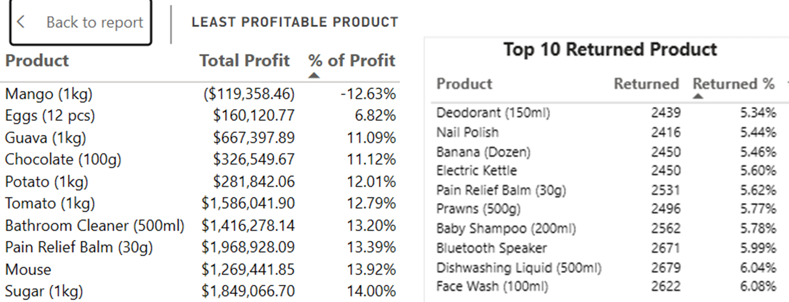

# DrutoBazar BI Suite - Centralized Dashboard for Strategic Sales and Marketing Insights
  

---

## Table of Contents
1. [Project Overview](#project-overview)
2. [Executive Summary](#executive-summary)
   - [Sales Analysis (2022–2023)](#sales-analysis-2022-2023)
   - [Key Deliverables as BI Analyst](#key-deliverables-as-bi-analyst)
3. [Executive Dashboard Insights](#executive-dashboard-insights)
   - [Revenue & Profit Trends](#revenue--profit-trends)
   - [Category Performance](#category-performance)
   - [Outlet & Sales Team Performance](#outlet--sales-team-performance)
4. [Customer Dashboard Insights](#customer-dashboard-insights)
   - [Customer Base Health](#customer-base-health)
   - [Retention & Loyalty](#retention--loyalty)
   - [Demographics & Segmentation](#demographics--segmentation)
   - [Customer Champion](#customer-champion)
5. [Product Dashboard Insights](#product-dashboard-insights)
   - [Sales vs. Profitability](#sales-vs-profitability)
   - [Returns Analysis](#returns-analysis)
   - [Least Profitable Products](#least-profitable-products)
6. [Questions & Caveats](#questions--caveats)
7. [Final Note](#final-note)

---

## Project Overview
Founded in 2017, DrutoBazar is a fast-growing retail chain operating across 56 districts in Bangladesh, specializing in electronic goods, daily household items, home décor and others. As a Business Intelligence Analyst, my role was to collaborate with stakeholders across Sales, Marketing, HR, and Retail Operations to design a SQL-based data warehouse, implement automated reporting, and develop interactive dashboards in Power BI. This initiative aimed to enhance data-driven decision-making, optimize performance tracking, and improve operational efficiency through advanced analytics and visualization.

## Executive Summary

### Sales Analysis (2022–2023)
- Over 800K+ sales records analyzed, revealing annual revenue of BDT 5.6 billion.
- Dhaka division contributed 21.37% of total sales.
- Electronics dominated revenue share with 41%, though this category had a 5.04% return rate.

### Key Deliverables as BI Analyst
- Designed and built a SQL-driven data warehouse to support enterprise-wide analytics.
- Developed multi-level access dashboards in Power BI for executives, managers, and team leads.
- Delivered quarterly summaries, monthly trends, week-over-week analysis, and automated daily reporting.
- Established scalable BI infrastructure for trend reporting, root cause analysis, and performance monitoring.

---

## Executive Dashboard Insights

### Revenue & Profit Trends
- Revenue grew consistently, peaking at BDT 237.49M in August 2023.
- Profit margins dipped to 26.82% in May 2023, indicating possible supplier cost increases, discount campaigns, or inefficiencies.

**Insight:** Sustained revenue growth paired with declining profit margins reduces overall profitability.  
**Recommendation:** Introduce profitability KPIs into reporting and investigate cost optimization opportunities.

### Category Performance
- Top 5 categories contributed 92% of revenue; Electronics alone generated BDT 1.14B in 2023.
- Home Décor ranked 3rd in sales but achieved a 28.92% profit margin, showing pricing efficiency.

**Recommendation:** Apply margin optimization strategies to low-performing categories and explore cross-selling opportunities.

### Outlet & Sales Team Performance
- Top 10 outlets generated 18.19% of total sales (BDT 1.01B).
- Sylhet and Naogaon exceeded expectations (+1.85%), while Pabna lagged.
- Sales concentration is skewed—top 10 salespeople drove 9% (BDT 494.3M) of revenue.

**Recommendation:** Develop training for underperforming outlets and incentive programs to balance sales distribution.

---

## Customer Dashboard Insights

### Customer Base Health
- Served 5,000 unique customers in 2023.
- Average revenue per customer: BDT 1.11M; AOV: BDT 6,964.46.

**Recommendation:** Segment customers by revenue tiers to personalize acquisition and retention strategies.

### Retention & Loyalty
- Loyalty program customers generated BDT 714.3M more than new customers.
- Top 100 customers contributed 59% (BDT 3.2B) of revenue, exposing concentration risk.

**Recommendation:** Expand loyalty initiatives with tiered rewards and diversify acquisition channels to reduce dependency.

### Demographics & Segmentation
- Customers 55+ years contributed the most revenue (BDT 1.67B).
- Customers 18–25 years generated only BDT 0.78B with lower order values.

**Recommendation:** Target the younger segment with promotional campaigns while introducing premium bundles for older customers.

### Customer Champion
- Top customer Tahmina Islam placed 104 orders worth BDT 1.13M, contributing 8.16% of sales.

**Recommendation:** Implement a customer success strategy to engage top spenders and mitigate dependency on individual customers.

---

## Product Dashboard Insights

### Sales vs. Profitability
- Top 10 products drove 43% (BDT 1.1B) of revenue.
- Products like Toasters had high sales but low margins.

**Recommendation:** Re-negotiate supplier contracts or adjust pricing for high-volume, low-margin items.

### Returns Analysis
- Overall return rate: 4.95%.
- Daily Household Needs category accounted for the majority of returns, with deodorants being the most returned SKU.

**Recommendation:** Investigate return reasons, improve quality checks, and refine return policies.

### Least Profitable Products
- Some SKUs consistently unprofitable (e.g., Mango in Fresh Produce at -12% margin).
 

**Recommendation:** Phase out or reposition unprofitable SKUs unless strategically essential.

---

## Questions & Caveats
### Open Questions:
- How is a “loyal” customer defined — repeat purchase, program membership, or both?
- Can reason codes for returns be added to enhance root cause analysis?
- Are demographic fields (age, loyalty) fully populated?
- Are outlet and salesperson sales tracked independently?

### Assumptions & Limitations:
- Revenue and profit data assumed net of discounts and returns.
- Missing demographic fields may affect segmentation accuracy.
- In-store exchanges may not be fully logged in ERP returns data.
- Sales attribution assumed correctly tied to outlets/sales reps.

---

## Final Note
The DrutoBazar BI Suite demonstrates how advanced analytics, SQL-based data warehousing, and Power BI dashboards can unlock actionable insights, improve sales and marketing performance, and drive strategic growth through data visualization, trend reporting, and stakeholder collaboration.

---

## 📄 License & Contact
Shoebur Rahman — © 2025 All Rights Reserved
**📩 Let's Connect!**  
If you’d like to see the case study, chat about the project, or collaborate, feel free to **[reach out via email](mailto:your-email@example.com)** or **connect on LinkedIn**.

---

## 🌟 About Me
Hi there! I'm **Shoebur Rahman**, a **Data Analyst** passionate about data cleaning, analytics, and storytelling.  
Let’s connect and explore data together! 🚀

---

🔗 [Portfolio](https://shoeburrahman.com) |🔗 [LinkedIn](https://www.linkedin.com/in/shoeburrahman/) | 🔗 [GitHub](https://github.com/AnalystShoeb) | 🔗 [Medium](https://medium.com/@analystshoeb)
